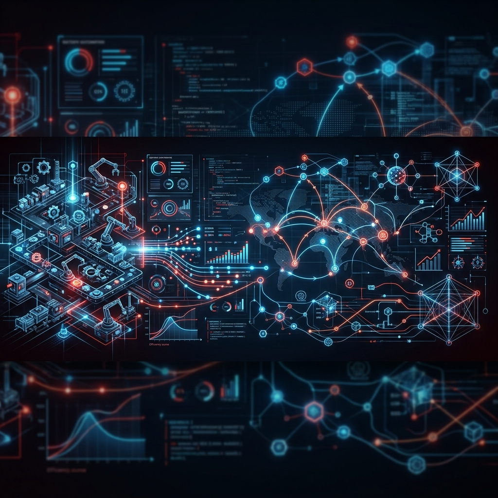

<div align="center">
  
</div>

<br>

# Industrial-Engineering-Hub 🏭: Endüstriyel Karar Destek ve Optimizasyon Ekosistemi

[]()
[]()
[]()
[]()

> "Mühendisler bir şeyler yapar; Endüstri Mühendisleri ise o şeyleri **daha iyi** yapar."

## 📜 Manifesto ve Amacımız
**Industrial-Engineering-Hub**, modern sistem tasarımı, optimizasyon ve veri odaklı yönetim prensiplerinin bir araya getirildiği bütünsel bir referans merkezidir. Bu ekosistem, karmaşık endüstriyel problemleri matematiksel modeller, istatistiksel araçlar ve ileri simülasyon teknikleri ile çözmeyi hedefler. Temel felsefemiz: **Sürekli İyileştirme (Kaizen) ve Maksimum Verimlilik.**

---

## 🏛️ Modül Mimarisi ve Külliyat

Bu depo, bir endüstri mühendisinin ihtiyaç duyacağı tüm kritik alanları bir "Masterclass" derinliğinde kapsar:

### 0️⃣ FAZ 0: Yöneylem Araştırması (Foundation)
* **LP ve Simplex:** Kısıtlı optimizasyonun matematiksel temelleri.
* **Ağ Optimizasyonu:** Lojistik ağ tasarımı, en kısa yol ve maksimum akış problemleri.

### 🟢 FAZ 1: İş Etüdü ve Ergonomi
* **Metot Mühendisliği:** Değer katmayan adımların (Muda) yok edilmesi ve standart iş tasarımı.
* **Rating & Allowance:** Performans derecelendirme ve endüstriyel tolerans rehberleri.

### 🔵 FAZ 2: Üretim Planlama ve Kontrol (PPC)
* **Talep Tahmini:** İleri zaman serisi analizleri ve tahmin motoru (Python).
* **EOQ & Stok:** Stok maliyet minimizasyonu ve yeniden sipariş noktası optimizasyonu.

### 🟠 FAZ 3: Kalite Mühendisliği (Six Sigma)
* **SPC & Standartlar:** İstatistiksel süreç kontrol tabloları ve kontrol grafikleri.
* **Proses Yeteneği:** Cp, Cpk analizleri ile süreç olgunluk ölçümü.

### 🚚 FAZ 4: Lojistik ve Tesis Planlama
* **Yer Seçimi:** Ağırlık merkezi ve AHP temelli tesis lokasyon modelleri.
* **Hat Dengeleme:** Montaj hattı optimizasyonu ve çevrim süresi yönetimi.

### 🎲 FAZ 5: Simülasyon ve Risk Analizi
* **DES (SimPy):** Fabrika akış modellerinin dijital ikizi.
* **Monte Carlo:** Kar/zarar ve proje süreleri için olasılıksal risk analizi.

### 🧠 FAZ 6: Karar Bilimi (Decision Science)
* **Çok Kriterli Karar Verme:** AHP, TOPSIS algoritmaları.

### 🌀 FAZ 7: Sistem Dinamiği ve Karmaşıklık
* **Kamçı Etkisi (Bullwhip):** Geri besleme döngüleri ve tedarik davranış modelleri.

### 🛰️ FAZ 8: Endüstriyel Zeka ve Analitik
* **Kestirimci Bakım:** RUL (Remaining Useful Life) tahminleme.

### 🏭 FAZ 9: Yalın Üretim
* **Kanban ve OEE:** Ekipman etkinlik ve çekme sistemleri.

### 💰 FAZ 10: Mühendislik Ekonomisi
* **Yatırım Analizleri:** NPV, IRR hesaplamaları.
* **Paranın Zaman Değeri:** Kârlılık simülasyonları.

### 🔧 FAZ 11: Güvenilirlik ve Bakım
* **Sistem Güvenilirliği:** Seri/paralel sistem arıza hesaplamaları.

### 📅 FAZ 12: Proje Yönetimi
* **Kritik Yol Metodu:** CPM, PERT ağ analizi ve süre optimizasyonu.

---

## 📂 Depo Hiyerarşisi (Directory Structure)

```text
Industrial-Engineering-Hub/
│
├── 00_Operations_Research/            # Optimizasyon ve Matematiksel Modeller
├── 01_Work_Study_and_Ergonomics/      # İş Etüdü ve İnsan Faktörleri
├── 02_Production_Planning/            # Üretim Planlama ve Stok
├── 03_Quality_Control/                # İstatistiksel Kalite ve Altı Sigma
├── 04_Facility_and_Supply_Chain/      # Tesis Tasarımı ve Lojistik
├── 05_Simulation/                     # Sistem Modelleme ve Risk
├── 06_Decision_Science/               # Karar Bilimi (AHP, TOPSIS)
├── 07_System_Dynamics_and_Complexity/ # Sistem Dinamiği ve Kamçı Etkisi
├── 08_Intelligence_and_Analytics/     # Endüstriyel Veri Analitiği
├── 09_Lean_Manufacturing/             # Yalın Üretim (Kanban)
├── 10_Engineering_Economics/          # Mühendislik Ekonomisi
├── 11_Reliability_and_Maintenance/    # Güvenilirlik Analizleri
├── 12_Project_Management/             # CPM ve PERT Analizi
│
├── data/                              # Örnek üretim ve talep veri setleri
├── assets/                            # Banner ve görseller
├── requirements.txt                   # Python bağımlılıkları
└── README.md
```

---

## 🛠️ Yazılım Stoku
* **Diller:** Python, R.
* **Kütüphaneler:** `SciPy` (Opt), `Pandas` (Data), `SimPy` (Sim), `PuLP` (LP), `Plotly` (Viz).

---

## 🚀 Horizon 2025: Endüstriyel Zekaya Doğru
Gelecek sürümlerde bu HUB; otonom tedarik zinciri ajanları, AI destekli çizelgeleme motorları ve IIoT veri hatlarının simülasyonu ile daha da derinleşecektir.

---
*Mükemmel sistem yoktur, her zaman optimize edilecek bir adım daha vardır.*